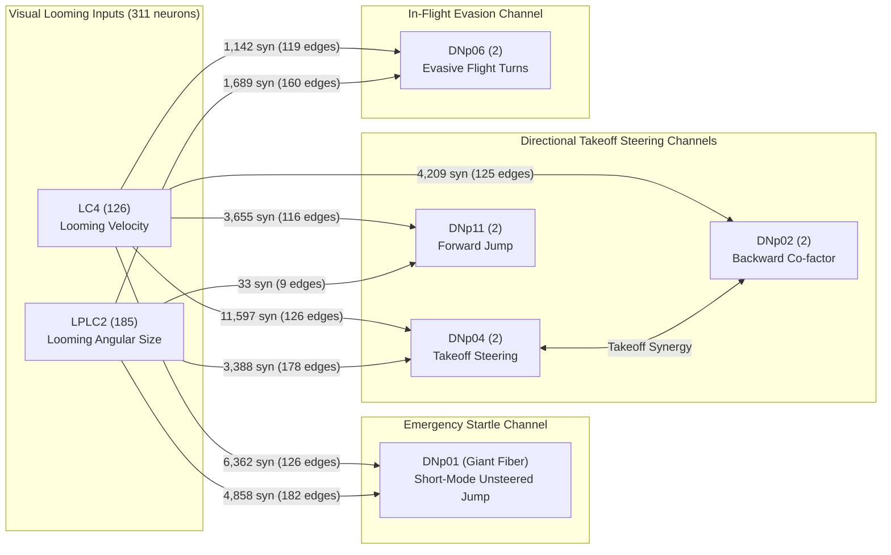

# Circuit v2 Specification — Drosophila Directional Visual Escape Circuit

**Circuit ID:** `circuit_v2`
**Version:** `2.0.0`
**Frozen Date:** 2026-09-22
**Source Dataset:** MaleCNS v1.0 (`male-cns:v1.0`)

---

## 1. Overview

Circuit v2 formalizes the expanded connectome-derived visual escape circuit of *Drosophila melanogaster* (specifically an Expanded Biologically Motivated Direct Feedforward Sensorimotor Model Circuit). Building upon the baseline Circuit v1, Circuit v2 incorporates the verified takeoff steering partners **DNp02** (synergistic takeoff partner with DNp04 for backward takeoff) and **DNp11** (forward jump takeoff) identified by Peek (2018) and Dombrovski et al. (2023 *Nature*).

| Metric | Circuit v1 (Baseline) | Circuit v2 (Expanded Directional) | Delta |
|---|---|---|---|
| **Total Neurons** | 317 | **321** | +4 neurons (2 bilateral pairs) |
| **Total Edges ($w \ge 3$)** | 11,286 | **11,557** | +271 edges |
| **Neuron Types** | 5 | **7** | +DNp02, +DNp11 |
| **Visual Projection Neurons** | 311 (126 LC4, 185 LPLC2) | **311** (126 LC4, 185 LPLC2) | Unchanged |
| **Descending Readout Neurons** | 6 (3 bilateral pairs) | **10** (5 bilateral pairs) | +4 DNs |
| **Max Synaptic Weight** | 172 | **172** | Unchanged |
| **Weight Threshold ($w_{\min}$)** | 3 | **3** | Unchanged |
| **Normalization** | Max ($\div 172$) | **Max ($\div 172$)** | Unchanged |

---

## 2. Neuron Populations

### 2.1 Visual Input Layer (311 Neurons)
- **LC4 (126 neurons: 71 Left, 55 Right):** Visual projection neurons from lobula to the LC4 optic glomerulus in the PVLP. Encodes visual looming expansion velocity.
- **LPLC2 (185 neurons: 94 Left, 91 Right):** Visual projection neurons from lobula plate/lobula to the LPLC2 optic glomerulus. Computes radial motion opponency to encode looming angular size.

### 2.2 Readout Layer (10 Descending Neurons)

| Type | Count | Hemisphere | Body IDs | Primary Behavioral Function | Literature Verification |
|---|---|---|---|---|---|
| **DNp01** | 2 | 1L, 1R | 10010 (L), 10001 (R) | **Primary readout:** Giant Fiber; unsteered emergency escape jump | Tanouye & Wyman (1980); von Reyn et al. (2014) |
| **DNp04** | 2 | 1L, 1R | 531898 (L), 11137 (R) | **Secondary readout:** Non-GF takeoff steering; co-activated with DNp02 for backward jump | Peek (2018); Dombrovski et al. (2023) |
| **DNp02** | 2 | 1L, 1R | 10197 (L), 10117 (R) | **Secondary readout:** Synergistic co-active partner with DNp04 for backward takeoff jump | Peek (2018); Dombrovski et al. (2023) |
| **DNp11** | 2 | 1L, 1R | 10259 (L), 10106 (R) | **Secondary readout:** Forward postural adjustment and forward escape jump | Peek (2018); Dombrovski et al. (2023) |
| **DNp06** | 2 | 1L, 1R | 10228 (L), 10584 (R) | **Secondary readout:** Evasive flight steering turns and wingbeat modulation | Kim et al. (2023); Namiki et al. (2018) |

### 2.3 Neurotransmitter Predictions
All 321 neurons in Circuit v2 are predicted cholinergic (acetylcholine) by the MaleCNS v1.0 classifier, with mean confidence scores ranging from 0.84 to 0.99.

---

## 3. Circuit Topology

### 3.1 Topology Diagram

### 3.2 Edge Summary by Class

| Edge Class | Count | Total Synapses | Mean Weight | Description |
|---|---|---|---|---|
| `visual_to_readout` | 1,141 | 36,933 | 32.37 | Direct feedforward visual drive to descending readouts |
| `intra_population` | 9,994 | 51,846 | 5.19 | Recurrent connections within LC4 or within LPLC2 |
| `cross_visual` | 388 | 1,806 | 4.65 | Cross-talk between LC4 and LPLC2 |
| `inter_readout` | 27 | 416 | 15.41 | Direct synaptic connections among descending neurons |
| `readout_to_visual` | 7 | 22 | 3.14 | Feedback connections from DNs to visual inputs |
| **Total** | **11,557** | **91,023** | **7.88** | **Complete frozen Circuit v2 graph** |

### 3.3 Visual Input to Descending Readouts ($w \ge 3$)

| Readout Population | LC4 Synapses (Edges) | LPLC2 Synapses (Edges) | Total Visual Synapses | Total Incoming Across CNS | Connectomic Visual Share |
|---|---|---|---|---|---|
| **DNp04** | 11,597 (126) | 3,388 (178) | 14,985 | 21,930 | **68.3%** |
| **DNp01** | 6,362 (126) | 4,858 (182) | 11,220 | 43,478 | **25.8%** |
| **DNp02** | 4,209 (125) | 0 (0) | 4,209 | 18,296 | **23.0%** |
| **DNp11** | 3,655 (116) | 33 (9) | 3,688 | 24,198 | **15.2%** |
| **DNp06** | 1,142 (119) | 1,689 (160) | 2,831 | 43,607 | **6.5%** |

### 3.4 Hemispheric Input Distribution

| Readout | Side | Body ID | LC4 Synapses | LPLC2 Synapses | Total Visual Input |
|---|---|---|---|---|---|
| DNp01 | Left | 10010 | 3,782 | 2,640 | 6,422 |
| DNp01 | Right | 10001 | 2,580 | 2,218 | 4,798 |
| DNp04 | Left | 531898 | 6,811 | 1,957 | 8,768 |
| DNp04 | Right | 11137 | 4,786 | 1,431 | 6,217 |
| DNp02 | Left | 10197 | 2,279 | 0 | 2,279 |
| DNp02 | Right | 10117 | 1,930 | 0 | 1,930 |
| DNp11 | Left | 10259 | 2,015 | 33 | 2,048 |
| DNp11 | Right | 10106 | 1,640 | 0 | 1,640 |
| DNp06 | Left | 10228 | 700 | 870 | 1,570 |
| DNp06 | Right | 10584 | 442 | 819 | 1,261 |

---

## 4. Computational Conventions

1. **Synaptic Weights:** Unsigned structural synapse counts. Normalized using linear division: $\text{weight\_normalized} = \frac{\text{weight}}{172}$.
2. **Matrix Convention:** $W[\text{post}, \text{pre}]$ — row index represents the postsynaptic neuron, column index represents the presynaptic neuron.
3. **Threshold:** $w_{\min} = 3$ applied after pair aggregation.
4. **Synaptic Polarity:** All 321 neurons are predicted cholinergic; functional synaptic signs (+1 for excitation) must be explicitly applied by Phase 4 simulation models.
5. **Retinotopy:** `RETINOTOPY = NOT_AVAILABLE`. Spatial receptive fields must be modeled through documented visual projection schemes.

---

## 5. Frozen Artifacts

| File | Format | Description |
|---|---|---|
| `circuit_v2_nodes.csv` | CSV | 321 neurons with identifiers, types, sides, populations, roles, and NT predictions |
| `circuit_v2_edges.csv` | CSV | 11,557 directed edges with raw and max-normalized weights |
| `circuit_v2.json` | JSON | Complete circuit graph and metadata |
| `circuit_v2_schema.json` | JSON | Schema definition for nodes, edges, and metadata |
| `circuit_v2_provenance.json` | JSON | Data provenance, pinned source checksums, and environment metadata |
| `circuit_v2_build_validation.json` | JSON | Build-time validation log (23/23 checks passed) |
