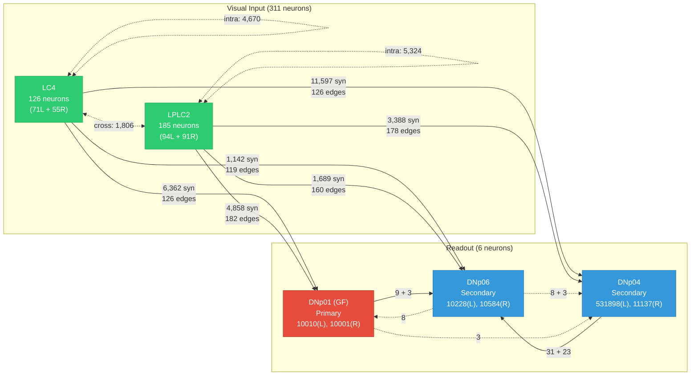

# Circuit v1 Specification — Drosophila Visual Escape Circuit

**Circuit ID:** `circuit_v1`
**Version:** `1.0.0`
**Frozen Date:** 2026-09-22
**Source Dataset:** MaleCNS v1.0 (`male-cns:v1.0`)

---

## 1. Overview

Circuit v1 is the frozen, machine-readable specification of the *Drosophila melanogaster* visual escape circuit, extracted from the MaleCNS v1.0 connectome. It captures the direct synaptic connectivity from looming-sensitive visual neurons to escape-triggering descending neurons.

| Metric | Value |
|--------|-------|
| Total neurons | 317 |
| Total edges (w ≥ 3) | 11,286 |
| Neuron types | 5 (LC4, LPLC2, DNp01, DNp04, DNp06) |
| Max synapse count | 172 |
| Weight threshold (w_min) | 3 |
| Normalization | max (÷ 172) |

---

## 2. Neuron Populations

### 2.1 Visual Input Layer

| Type | Count | Role | Description |
|------|-------|------|-------------|
| LC4 | 126 (71L + 55R) | Looming sensor | Looming-sensitive visual projection neuron |
| LPLC2 | 185 (94L + 91R) | Looming sensor | Lobula plate / lobula columnar neuron |

### 2.2 Readout Layer (Descending Neurons)

| Type | Count | Role | Body IDs | Description |
|------|-------|------|----------|-------------|
| DNp01 | 2 (1L + 1R) | **Primary** readout | 10010 (L), 10001 (R) | Giant Fiber — primary escape trigger |
| DNp04 | 2 (1L + 1R) | Secondary readout | 531898 (L), 11137 (R) | Descending neuron, highest total visual input |
| DNp06 | 2 (1L + 1R) | Secondary readout | 10228 (L), 10584 (R) | Descending neuron |

### 2.3 Neurotransmitter

All 317 neurons are **predicted acetylcholine** (MaleCNS v1.0 classifier). This is a prediction, not an experimental determination. Confidence scores range from 0.93 to 0.99.

---

## 3. Circuit Topology

### 3.1 Circuit Diagram

### 3.2 Edge Summary by Class

| Edge Class | Count | Total Weight | Mean Weight | Description |
|------------|-------|-------------|-------------|-------------|
| visual_to_readout | 891 | 29,036 | 32.6 | LC4/LPLC2 → DN (primary circuit function) |
| intra_population | 9,994 | 51,846 | 5.2 | Within LC4 or within LPLC2 |
| cross_visual | 388 | 1,806 | 4.7 | Between LC4 and LPLC2 |
| inter_readout | 8 | 88 | 11.0 | Between DN types |
| readout_to_visual | 5 | 16 | 3.2 | DN → visual (feedback, very weak) |

### 3.3 Visual Input to Readouts

| Pathway | Edges | Total Weight | Per-Neuron Mean |
|---------|-------|-------------|-----------------|
| LC4 → DNp01 | 126 | 6,362 | 50.5 |
| LPLC2 → DNp01 | 182 | 4,858 | 26.7 |
| LC4 → DNp04 | 126 | 11,597 | 92.0 |
| LPLC2 → DNp04 | 178 | 3,388 | 19.0 |
| LC4 → DNp06 | 119 | 1,142 | 9.6 |
| LPLC2 → DNp06 | 160 | 1,689 | 10.6 |

### 3.4 Hemispheric Input Summary

| Readout | Side | LC4 Input | LPLC2 Input | Total Visual |
|---------|------|-----------|-------------|-------------|
| DNp01 | Left | 3,782 | 2,640 | 6,422 |
| DNp01 | Right | 2,580 | 2,218 | 4,798 |
| DNp04 | Left | 6,811 | 1,957 | 8,768 |
| DNp04 | Right | 4,786 | 1,431 | 6,217 |
| DNp06 | Left | 700 | 870 | 1,570 |
| DNp06 | Right | 442 | 819 | 1,261 |

### 3.5 Inter-Readout Connectivity

| Source | Target | Weight |
|--------|--------|--------|
| DNp04(R) → DNp06(R) | ipsilateral | 31 |
| DNp04(L) → DNp06(L) | ipsilateral | 23 |
| DNp01(R) → DNp06(R) | ipsilateral | 9 |
| DNp06(R) → DNp04(R) | ipsilateral | 8 |
| DNp06(L) → DNp01(L) | ipsilateral | 8 |
| DNp01(L) → DNp06(L) | ipsilateral | 3 |
| DNp06(L) → DNp04(L) | ipsilateral | 3 |
| DNp01(L) → DNp04(L) | ipsilateral | 3 |

---

## 4. Computational Conventions (Frozen)

### 4.1 Synaptic Weights
- **Type:** Unsigned structural synapse counts
- **Convention:** `W[post, pre]` — row = postsynaptic, column = presynaptic
- **Threshold:** w_min = 3 (edges with fewer than 3 synapses are excluded)
- **Normalization:** max-normalization (`weight / 172`), range [0, 1]
- **Note:** These are connectome observations. Phase 4 decides how to convert to model parameters.

### 4.2 Excitatory/Inhibitory Signs
- All 317 neurons are predicted acetylcholine (excitatory)
- **Signs are NOT applied** to frozen weights — weights are unsigned
- The `pre_nt` column in the edge CSV records the presynaptic neurotransmitter
- Phase 4 must decide sign convention (e.g., +1 for acetylcholine)
- This is a **computational assumption**, not a connectome fact

### 4.3 Retinotopy
- **Status:** NOT AVAILABLE
- MaleCNS v1.0 does not populate retinotopic metadata for LC4/LPLC2
- Lobula column ROI identifiers exist as potential proxies but are not extracted
- **No fabricated visual-angle mapping is included**
- Phase 4 must not invent spatial mappings without explicit documentation

---

## 5. Frozen Artifacts

| File | Format | Description |
|------|--------|-------------|
| `circuit_v1_nodes.csv` | CSV | 317 neurons with metadata |
| `circuit_v1_edges.csv` | CSV | 11,286 edges with weights |
| `circuit_v1.json` | JSON | Complete machine-readable circuit |
| `circuit_v1_schema.json` | JSON | Schema (field names, types, units) |
| `provenance.json` | JSON | Source data checksums and versions |
| `build_validation.json` | JSON | Build-time validation results |

---

## 6. Data Provenance

| Source File | SHA-256 (first 16) | Size |
|------------|-------------------|------|
| body-annotations-male-cns-v1.0-minconf-0.5.feather | `2177e246113e4cfb` | 14.5 MB |
| connectome-weights-male-cns-v1.0-minconf-0.5.feather | `e35da783d1c686b2` | 1.05 GB |
| body-neurotransmitters-male-cns-v1.0.feather | `95c9289220663abe` | 43.3 MB |

| Software | Version |
|----------|---------|
| pandas | 3.0.6 |
| pyarrow | 25.0.1 |
| numpy | 2.5.3 |
